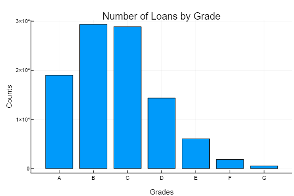
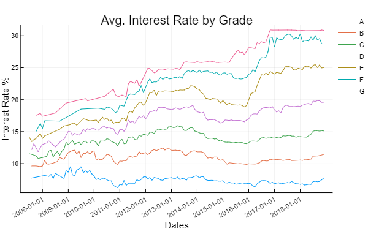
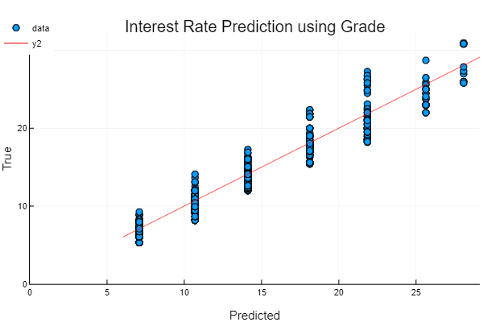

# Midterm Report
## Lending Rate Prediction
### Authors:
- Katie Tubbs (kt392)
- Sam Shah (sns224)
- Kyle Walsh (kew96)

## Precautions
We plan to avoid overfitting by ensuring that our model is not too complex, ie. adding too many features to the models. Since our data set is so large, we will use cross-validation to help select the best model. We have already selected 39 features from 151 to work with, and will continue to select a smaller subset of this group of 39 after more testing. We plan to avoid underfitting by ensuring that our models are complex enough with a sufficient number of features. More specifically, we will test the effectiveness of the models we develop by computing various error estimates corresponding to each model. For example, we have computed the mean squared error of each of the preliminary models so far, and will continue to use this error estimate as the baseline to select the most effective models going forward.

## Data Visualizations
### Features
Before any data cleaning, there were 2,260,701 examples and 151 features present. We then listed the column names and selected 39 features that are most relevant to our models. The following graphs offer summary statistics on the dataset, we randomly selected 100,000 data points to speed up computation.

### Missing/Corrupted Data
We used the ismissing function to determine how much data is missing, and approximately 10 features had a significant number of missing examples and the remaining had very few missing values. To correct this issue, we used the dropmissing function to remove rows with minimal missing data as the rows with more missing data had reasons to be missing, i.e. the joint annual income would only be populated if a couple was applying for a loan together.

## Preliminary Analyses
For preliminary testing and validation purposes, we randomly selected 100,000 examples to run a few preliminary analyses on the data. We chose our 39 features based upon a reasonable judgement of their relationship to interest rates, and are continuing to narrow down which features are truly significant and which are non-value added features, which we will either throw away or place very little emphasis on. For example, grade and term are fundamental predictors of interest rates based on its definition and mathematical definitions of interest rates.

  
   

## Next Steps
We still need to finalize which models will be used to answer each of our two questions: 1. What is the ideal interest rate for a given loan? 2. At what price is a given loan an intelligent investment? We have run a few preliminary models discussed above, and have computed the mean squared error on each to compare the accuracy to models we will compute throughout the rest of the semester. We ran least squares regression using only grade as a predictor, and we will use this error estimate as a baseline to compare to future models.  In addition, we need to determine the smaller set of features that we will focus this analysis on, which will be no larger than 25. One way we plan to do this is through an XGBoost model to choose the most important features.

To address the second question, we plan to group the examples by grade and implement a decision-tree based algorithm, such as XGBoost, within each group. This way, we can set an “intelligent investment” threshold for each loan grade, then classify each example accordingly. This is necessary because the adjustment for risk and volatility of each interest rate is higher for each loan grade from A to G. 

## Subset of Features and Definiteions
- __loan_amnt__: The listed amount of the loan applied for by the borrower. If at some point in time, the credit department reduces the loan amount, then it will be reflected in this value.
- __issue_d__: The month in which the loan was funded
- __term__: The number of payments on the loan. Values are in months and can be either 36 or 60.
- __int_rate__: Interest Rate on the loan
- __grade__: LC assigned loan grade
- __sub_grade__: LC assigned loan subgrade
- __emp_title__: The job title supplied by the Borrower when applying for the loan.
- __emp_length__: Employment length in years. Possible values are between 0 and 10 where 0 means less than one year and 10 means ten or more years.
- __home_ownership__: The home ownership status provided by the borrower during registration or obtained from the credit report. Our values are: RENT, OWN, MORTGAGE, OTHER
- __annual_inc__: The self-reported annual income provided by the borrower during registration.
- __purpose__: A category provided by the borrower for the loan request.
- __zip_code__: First 3 digits of borrower’s zip-code. Only given 3 digits to preserve privacy
- __dti__: A ratio calculated using the borrower’s total monthly debt payments on the total debt obligations, excluding mortgage and the requested LC loan, divided by the borrower’s self-reported monthly income.
- __delinq_2yrs__: The number of 30+ days past-due incidences of delinquency in the borrower's credit file for the past 2 years
- __earliest_cr_line__: The month the borrower's earliest reported credit line was opened
- __open_acc__: The number of open credit lines in the borrower's credit file.The combined self-reported annual income provided by the co-borrowers during registration
- __annual_inc_joint__: The combined self-reported annual income provided by the co-borrowers during registration
